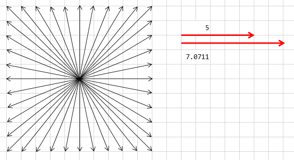
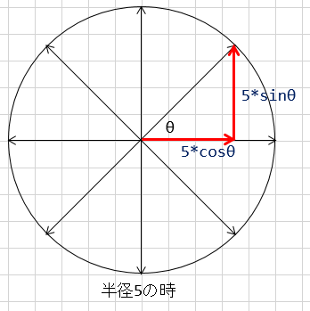

# 仕上げ

## 光が暗くなるのを直す
シーンが切り替わるとゲームが暗くなってしまう。これはエディターで動かしている時だけの問題なのだが、困ることもあるので直し方を紹介する。

原因はグローバルイルミネーション(大域照明=GI)のデータであり、Unityでよく相談される問題である。

- 参考： https://youtu.be/mEjT_7qZnHs

シーンを照らす光は、物体に直接当たっている光だけではない。環境光(Environment Lighting)という大気が乱反射する光(Ambient)や、他の物体が跳ね返した光(Reflection)といった光からも照らされている。このような周辺の環境の影響による光をグローバルイルミネーションという。フォトリアルなCGに大切な要素である。

GIは、大気の乱反射や、周囲の物体の反射の影響によるものなので、計算量は膨大になる。そこで、予めこのあたりの空間はこのような光を受ける、というデータを計算しておいて、それをライティングのデータに加えることでリアルタイムに処理している。

この計算には時間がかかるため、常に計算をしているとUnityの操作性が落ちてしまう。そこで、エディター時は暫定の計算をキャッシュしておいて、それを使うことで高速化している。このキャッシュは、シーンを切り替えると消えてしまうため、シーンが切り替わった後にGIのデータが失われて、直接光のみの照明になってしまい、画面が暗くなるのである。

エディターで作業している時にこの症状を避けるには、ライトの設定がある程度決まったところで、GIのデータを手動で生成する。

- [Window]メニューから[Lighting]を選択
- ウィンドウ下の[Auto]のチェックを外す
- [Build]ボタンが押せるようになるのでクリック
- 作業が終わるまで待つ

以上で、環境光のデータが生成されるので、シーンが切り替わったあとも暗くならない。

<b>ビルドすると、[Auto]に戻すか、再度ビルドしない限り、光や周囲の状況を変化させても、環境光が変化の影響を受けなくなるので注意。ライティングなどを変更した場合は、ビルドをし直すこと。</b>

最初に書いた通り、これはUnityエディターのための措置なので、ビルドした実行ファイルは最初からちゃんと動く。最終的にビルドした実行ファイルで展示などを行う予定の場合は気にしなくてもよい。

## ゲームオーバー・クリア時に動きをとめる
- 案1)ゲーム時間を止める
- 案2)Rigidbodyを全て検索して無効にする
- 案3)Rigidbodyを持っているゲームオブジェクトを全てモック化する

案2,3はいずれも処理の負荷が重いので、できればやりたくない。そこで、案1の物理時間を停止する方法を試す。

ゲームの進行時間は、`Time.timeScale`プロパティーで設定できる。1だとリアルタイムに動き、2にすると時間の流れが2倍になり、0.5にすれば時間の流れは1/2になる。スローモーションにしたり、早まわしの演出に使われる。

このパラメーターに0を設定すれば、時間が流れなくなるので、全てのオブジェクトを停止させることができる。

- `GameManager.cs`を開く
- シーンの切り替え時に`Time.timeScale = 0;`を実行

このままだと、次にゲームを開始した時に時間が流れなくなってしまうので、ゲームの開始時に`Time.timeScale = 1;`を追加する

## アイテムや敵を出現させるためのオブジェクトを作る
現在は画面内の範囲で乱数にアイテムや敵を出現させているが、これだとステージなど、面データを作ることができない。出現タイミングや、出現場所を自在に設定するテクニックとして、スポーナーオブジェクト(SpawnerObject)を作ることがよく行われる。

### スポーナーオブジェクトの設計
以下のような機能を持たせる。

- 出現させるオブジェクトのプレハブを持つ
  - これにより、同じスポーナーオブジェクトで、アイテムと敵の出現を作り分ける必要がない
- 何匹出現させるかの数を持つ
- 出現範囲を設定
  - `Bounds`は、`center`で中心点を、`extends`でサイズの半分の値を示せる、矩形範囲を表すオブジェクト
  - これで出現範囲を設定して、Gizmoを使って画面に表示する
- 速度の範囲を設定

### 作成
オブジェクトを作成する。

- 空のゲームオブジェクトを作成
- 名前を`Spawner`に変更

スクリプトを作成して、プロパティーを定義する。

- `Spawner`オブジェクトに、[New Script]で`Spawner`スクリプトを生成
- スクリプトは`Scripts`フォルダーに移動
- `Spawner`スクリプトを開く
- 以下を追加
  - `public GameObject PrefSpawn;`
  - `public int SpawnCount = 5;`
  - `public float MinSpeed = 2f;`
  - `public float MaxSpeed = 8f;`
  - `public Bounds [] SpawnBounds;`

出現場所をシーンビューに描画するメソッドを以下の通り追加する。

```
    private void OnDrawGizmos()
    {
        foreach (Bounds pos in SpawnBounds)
        {
            Gizmos.DrawWireCube(pos.center, pos.size);
        }
    }
```

以上できたら、保存して、Unityに切り替える。ビルドが通ったら、以下を設定する。

- `Pref Spawn`欄に、敵をドラッグ＆ドロップ
- `Spawn Bounds`欄の`Size`を4にする
- Elementが4つ追加されるので、Sceneビューを見ながら、上下左右の4箇所の出現範囲を設定する
  - この時、枠が表示されるように、[Hierarchy]ビューのオブジェクトを全て選択するとよい

現在、敵を出現させている処理は不要になったので削除する。

- `GameManager.cs`を開く
- `Start`メソッドの敵とアイテムの出現ルーチンを削除するか、コメントアウト
- 保存する

ボールや敵の動き出しスクリプトは不要になったので、`Move Ball`スクリプトの`Start`メソッドから、速度と座標の設定コードをコメントアウトする。

```cs
	void Start () {
        /*
		rig = GetComponent<Rigidbody> ();
		rig.velocity = new Vector3 (vx, vy, 0f);

		// 自分の座標をランダムで設定
		Vector3 pos = new Vector3 (
			Random.Range (MIN_X, MAX_X),
			Random.Range (MIN_Y, MAX_Y),
			0f);
		transform.position = pos;
        */

		// 自分のタグがItemかを確認
		// if文で条件式が省略されていた場合、
		// 条件式のところが、trueかfalseを返すようになっている
		if (CompareTag ("Item")) {
			BallCount++;
			Debug.Log (BallCount);
			//CountText.text = "" + BallCount;
		}
	}
```

出現ルーチンを作成する。流れは以下の通り。

- `Spawn Count`の回数、ループを回す
- `Bounds`の配列数で乱数を出し、どの`Bounds`に出現させるか決める
- 決めた`Bounds`の`min`と`max`の範囲で乱数を生成して、出現座標にする
- 速度を求める
- 生成する

### 速度の求め方
これまでは、-5～5までのような乱数で速度を求めていたが、この方法だとxとyのいずれも0になり、動かないものがでてくる可能性がある。

また、動く角度によって最高速度が変化してしまう欠点がある。



最大の速さを5とした場合、真横や真上の場合は長さは`5`だが、XとYのいずれも`5`だった場合は、`7.07・・・`という長さになる。

方向に関わらず、長さを揃えたい場合に使うのが円の考え方である。円周上の点は、円の中心から同じ距離である。つまり、円周上のどこかの点を速度にすれば、欲しい長さのベクトルが得られる。



円周上のx座標とy座標を求めるのが`cos`と`sin`である。

- `cos`は、半径1の円周上において、指定の角度(θ)の時の`x`座標を求める関数
- `sin`は、半径1の円周上において、指定の角度(θ)の時の`y`座標を求める関数

`cosθ`を`x`座標、`sinθ`を`y`座標にすれば、`θ`の角度の時の半径1の円周上の座標が得られるのである。

`1`は魔法の数字である。これに欲しい長さを掛ければ、欲しい長さのベクトルが得られる。上記で求めた`cosθ`と`sinθ`のどちらにも求めたい長さを掛ければ、`θ`の時の欲しい長さのベクトルが得られるのである。

以上から、以下のようにすれば、ランダムな角度の、欲しい速さのベクトルを求めることができる。

- 0～Mathf.PI*2fの乱数を求めて、角度にする
- 上記の角度を使って、`Mathf.cos()`と`Mathf.sin()`で、XとYの速度を生成
- 生成したベクトルに求めたい速度を掛ける

以上をプログラム化する。

## 跳ね返らなくなっていく
しばらく動かしていると、ボールが上下のみや、左右のみ。下手すると、角で停止してしまう。これは、速度が弱い場合は跳ね返さないような設定があるからである。

今回はそのような処理は不要なので、この機能を無効にする。

- [Edit]メニューから、[Project Settings]>[Physics]を選択
- [Inspector]ビューの[Bounce Threshold]を`0`にする
  - バウンドの閾値(いきち)である。これを下回る速度は無視される。無視されないように`0`にした

以上できたら、`Spawner`を[Project]ビューにドラッグ＆ドロップしてプレハブ化する。プレハブ化した`Spawner`をもう一つ[Hierarchy]ビューにドラッグ＆ドロップして追加して、今度はアイテムの出現設定を行う。


